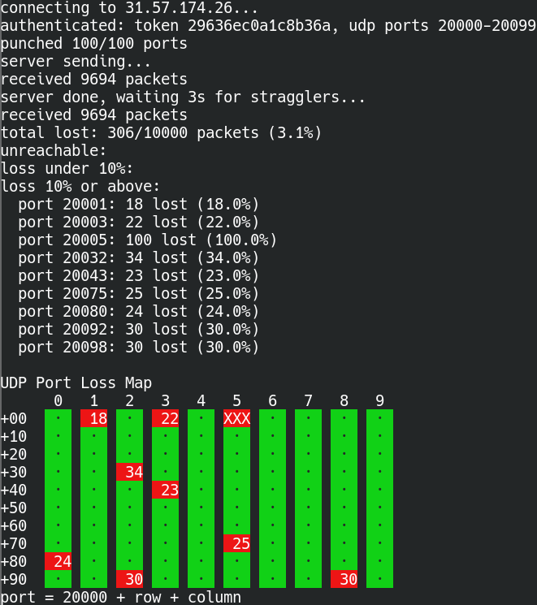

# lagtest

`lagtest` is a small network diagnostic tool for measuring UDP packet loss across
100 consecutive ports. It is intended to help diagnose link aggregation / LACP
hashing issues by making loss visible per UDP flow.

The project includes:

- `server.go`: Go server that listens for a TCP control connection and 100 UDP
  test ports.
- `client.py`: Python client that authenticates, runs the UDP test, and prints a
  per-port loss report.

## Example Output



## Requirements

- Go 1.21 or newer for the server
- Python 3 for the client
- Network access between the client and server for:
  - TCP control port, default `6300`
  - 100 consecutive UDP ports, default `6301` through `6400`

## Quick Start

Start the server:

```sh
go run server.go -password 'change-me'
```

Run a client test from another machine:

```sh
LAGTEST_PW='change-me' python3 client.py SERVER_IP send
```

Run the reverse direction, where the server sends UDP packets back to the
client:

```sh
LAGTEST_PW='change-me' python3 client.py SERVER_IP recv
```

Replace `SERVER_IP` with the server hostname or IP address.

## Server Usage

```sh
go run server.go -password 'change-me' [-listen :6300] [-udp 6301]
```

Options:

- `-password`: Shared password required by clients.
- `-listen`: TCP control listen address. Defaults to `:6300`.
- `-udp`: First UDP port in the 100-port test range. Defaults to `6301`.

If you change `-udp`, make sure the selected port and the next 99 consecutive
UDP ports are open and not already in use.

## Client Usage

```sh
python3 client.py [-b LOCAL_IP] HOST[:PORT] [send|recv] [LOCALPORT]
```

Arguments:

- `HOST[:PORT]`: Server address and optional TCP control port. The default port
  is `6300`.
- `send`: Client sends UDP packets to the server. This is the default mode.
- `recv`: Server sends UDP packets back to the client after UDP hole punching.
- `LOCALPORT`: Optional first local UDP port. When set, the client binds to
  consecutive local ports so flow hashing is reproducible across runs.
- `-b LOCAL_IP`: Optional local source address for TCP and UDP sockets.

The password is read from `LAGTEST_PW` if set. Otherwise, the client prompts for
it.

Examples:

```sh
# Default send test
LAGTEST_PW='change-me' python3 client.py 192.0.2.10

# Connect to a non-default TCP control port
LAGTEST_PW='change-me' python3 client.py 192.0.2.10:7300 send

# Reverse direction test
LAGTEST_PW='change-me' python3 client.py 192.0.2.10 recv

# Bind client traffic to a specific local IP and deterministic local UDP ports
LAGTEST_PW='change-me' python3 client.py -b 198.51.100.20 192.0.2.10 send 50000
```

## Output

Each run sends 100 packets per UDP port. The report groups ports by loss level
and prints a 10x10 UDP Port Loss Map:

- Green cells: no packet loss
- Yellow cells: loss up to 10%
- Red cells: loss above 10%
- Blue cells / `---`: unreachable or hole punch failed

The displayed port number is calculated as:

```text
port = base + row + column
```

## Development

Build the server:

```sh
go build
```

Check the client help:

```sh
python3 client.py --help
```
